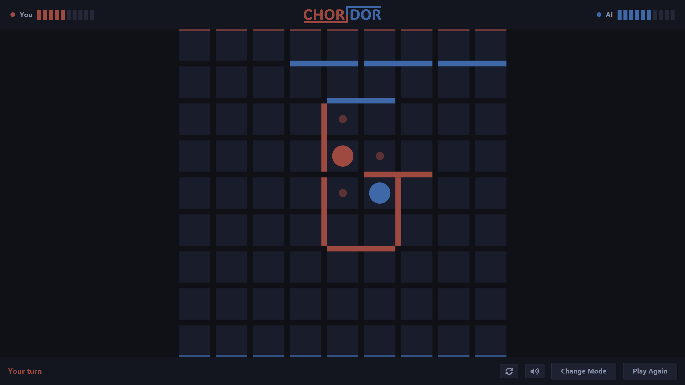
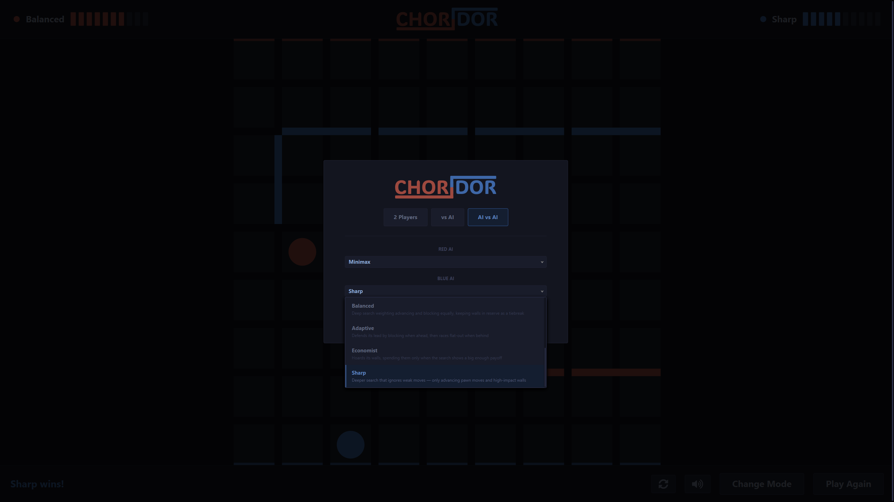
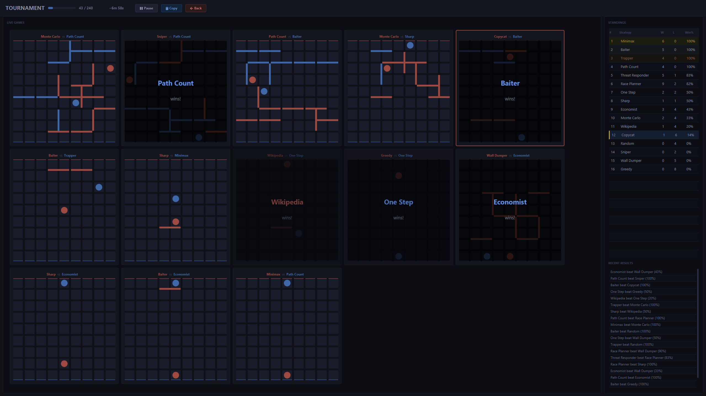

<p align="center">
    
</p>

<p align="center">
    <strong>A desktop implementation of Quoridor built with Java and JavaFX.</strong>
</p>

<p align="center">
    <a href="https://github.com/JoachimVN/CHORIDOR/releases">Releases</a>
    |
    <a href="https://github.com/JoachimVN/CHORIDOR/issues">Issues</a>
    |
    <a href="https://github.com/JoachimVN/CHORIDOR/pulls">Pull Requests</a>
    |
    <a href="https://github.com/JoachimVN/CHORIDOR/milestones">Milestones</a>
    |
    <a href="https://github.com/JoachimVN/CHORIDOR/commits/main">Commits</a>
</p>

CHORIDOR is a desktop implementation of Quoridor, which is a two-player strategy board game played on a 9×9 grid.
Each player races to reach the opposite side of the board while placing walls to block their opponent's path.
Walls must never completely seal off a player's route, keeping every game solvable until the final move.

## Screenshots

<p align="center">
    
    <br>
    <em>In-game board</em>
</p>

<p align="center">
    
    <br>
    <em>Setup screen</em>
</p>

<p align="center">
    
    <br>
    <em>Tournament with AI vs AI and live boards</em>
</p>

## Why This Project

A personal project built to explore:

- Object-oriented domain modeling
- JavaFX UI architecture and canvas rendering
- Rule engine design (move validation, BFS path-checking)
- Game engines and game theory
- Testability and maintainability

## Core Features

- Pawn moves with jump logic, wall placement with path-check enforcement
- Human vs Human local play
- Human vs AI
- AI vs AI simulation
- Live tournament for AIs
- Dark-slate themed board with legal-move dot indicators and hover-preview for walls
- Changing sides, flipping boards, and win overlay
- Sound effects for moves, jumps, wall placements, wins, and more
- Multiple AI strategies
- Game review to look back on moves
- Cross-platform packaging (Windows EXE, Linux zip, macOS DMG, portable JAR)

## Tech Stack

- Java 25
- JavaFX 26
- Maven
- JUnit 5
- Gson

## Tools Used

- Visual Studio Code
- Git
- GitHub
- Photopea
- Soundation
- Audacity

## Getting Started

### Prerequisites

- JDK 25 installed and available on PATH
- Maven 3.9+ installed

### Run the App (development)

```bash
mvn javafx:run
```

### Run Tests

```bash
mvn test
```

Generate coverage report:

```bash
mvn verify
```

## Build and Distribution

### Releases

Pushing a `v*` tag triggers the release workflow, which builds and uploads all distribution artifacts automatically:

| Asset | Platform |
| --- | --- |
| `CHORIDOR-<version>-windows.exe` | Windows installer (bundles JRE) |
| `CHORIDOR-<version>-linux.zip` | Linux app-image |
| `CHORIDOR-<version>-macos.dmg` | macOS disk image (Apple Silicon) |
| `CHORIDOR-<version>-portable.jar` | Portable fat JAR (all platforms) |

### Portable JAR (cross-platform)

```bash
mvn package -Pportable-jar
```

Produces a fat runnable JAR that runs on Windows, Linux, and macOS without any additional install.

### Windows EXE installer

Requires [WiX Toolset v3](https://wixtoolset.org/) installed and on PATH.

```bash
mvn package -Pexe
```

Produces a Windows installer at `target/dist/CHORIDOR-<version>.exe`. The installer bundles a JRE — recipients need nothing pre-installed.

### Linux app-image

```bash
mvn package -Plinux
```

Produces a zipped app-image at `target/dist/CHORIDOR-<version>-linux.zip`. Extract and run `CHORIDOR/bin/CHORIDOR`.

### macOS DMG (Apple Silicon)

```bash
mvn package -Pmac
```

Produces a disk image at `target/dist/CHORIDOR-<version>-macos.dmg`. Intel Mac users should replace the `mac-aarch64` classifier with `mac` in the `mac` profile in `pom.xml`.

## Project Structure

```text
src/main/java/io/github/joachimvn
    App.java                 # JavaFX application entry point and UI wiring
    Launcher.java            # Fat-JAR entry point
    core/model/              # domain model (GameState, Player, Wall, Move, Position, …)
    core/rules/              # rules engine (MoveValidator, PathChecker, GameEngine)
    ai/                      # Strategy interface, Difficulty enum, and all AI strategies
    ui/
        GameController.java  # game state bridge between AI/rules and the UI
        BoardView.java       # BoardView canvas
        bars/                # TopBar, BottomBar, ReviewBar
        overlays/            # SetupOverlay, GameOverOverlay
        common/              # UiScale, UiConstants, LogoFactory

src/main/resources
    css/                     # UI styling
    fonts/                   # custom typeface
    images/                  # logos and visual assets
```

## Developer

[Joachim Valdersnes Nilsen](https://github.com/JoachimVN)
